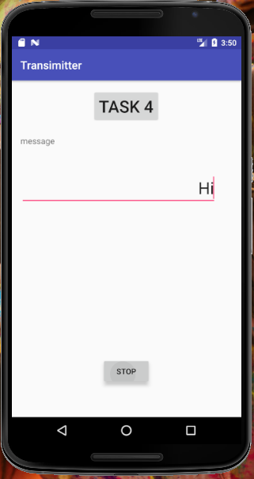
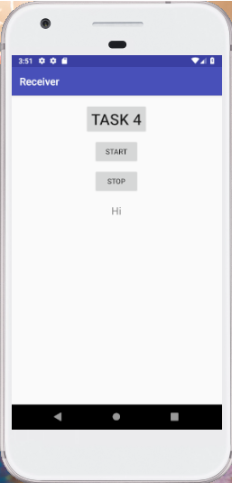

# Device-to-device Communication over Audio 

A simple one-directional communication between transmitter and receiver based on audible and inaudible frequency.

## Objective

1. Gain insight to audio-based data communication applicable to current mobile devices,

2. Master the access to speaker and microphone in mobile devices, and

3. Learn how to design and implement a basic audio-based data transmitter and receiver for personal mobile devices

## Getting Started

You may need to download Android Studio and import the project following the guides below.

### Prerequisites

Download [Android Studio](https://developer.android.com/studio/) or other IDE

### Installing

Install Android Studio.

Build with min SDK 24.

### Run

Run on simulator or real android devices.

## Quick Usage Demo (main application features)

   

Main feature: 

When you transimit some text over audio to receiver, the receiver will receive the audio frequency and transform back to the text. 

e.g. When Hi is entered and play button is pressed, the android device will emit sound. The other android device simulator will listen on it and transform back to the text.

## Authors

* **Allen Li**

## License

This project is licensed under the MIT License - see the [LICENSE.md](LICENSE.md) file for details
